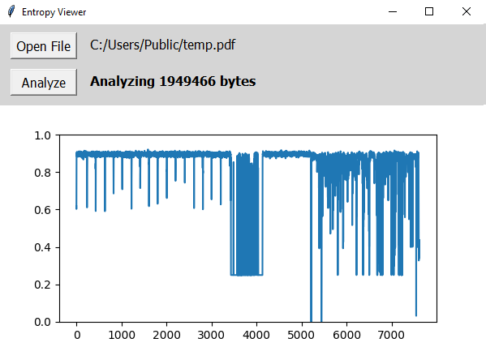

# Entropy Viewer

Python app to graph file entropy for cryptography analysis

## Description

This is a small application to view the entropy of a file by graphing the entropy of 256 byte sections and graphing the output. The entropy is calculated using a method to find Shannon's entropy and is graphed using matplotlib to create visual results. Program was built using a simple tkinter gui in Python with a file dialog for input. 

The main use for this appplication is to detect encryption keys within a given file. Since encrypted bytes are much more likely to have higher entropy than its neighboring bytes, encrypted data can be found by graphing the entropy of a file over the length of its data and searching for hotspots. 

## Getting Started

### Dependencies

* Python 3.0 or higher
* Python modules installed: tkinter, matplotlib

### Installing

* Download the latest release to your computer

### Executing program

* Run the program file on your computer
* You can also use the following terminal command to run the GUI: 
```
python entropy-viewer.pyw
```
* Alternatively, you can call the program on the file directly from the terminal:
```
python entropy-viewer.py (file_name)
```

## Usage

> :warning: Do not run this program on **large** files (>100 MB)! Runs slowly without a high end processor

### Examples

| Simple PNG File ~2MB | Simple PDF File ~2MB | Random Bytes ~2MB |
| --- | --- | --- |
|  |  | 

## License

This project is licensed under the MIT License - see the LICENSE file for details

## Acknowledgments

Inspiration for the project given below: 
* [Algorithm](https://stackoverflow.com/a/990517)
* [Research](https://en.wikipedia.org/wiki/Entropy_(information_theory))
